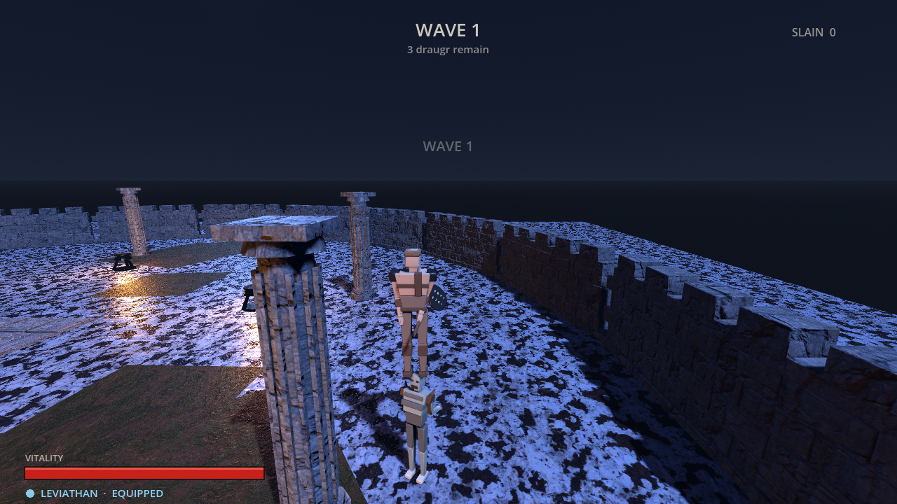

# Midgard Fury

A visceral Norse hack-and-slash built in **Godot 4.7** on the **GL Compatibility**
renderer, so the same build runs in any WebGL 2.0 browser. Throw the Leviathan
axe, leave it buried in a draugr's chest, then recall it along a Bezier arc that
cleaves everything on the way back.

**▶ Play: https://xoloteach.github.io/Horror/**



Every asset in this repo is generated from source in this repo — meshes from
headless Blender scripts, sound effects from a Python synthesiser. Nothing was
hand-modelled and nothing is licence-encumbered.

---

## Controls

| Action | Keyboard / Mouse | Touch |
|---|---|---|
| Move | `W` `A` `S` `D` | left thumbstick |
| Look | mouse | drag anywhere on the right |
| Light attack | `LMB` | **ATTACK** |
| Heavy attack | `F` | **HEAVY** |
| Aim (over-the-shoulder) | hold `RMB` | **AIM** (toggle) |
| Throw axe | `LMB` while aiming | **ATTACK** (reads *THROW* while aiming) |
| Recall axe | `R` / `Q` / middle mouse | **RECALL** |
| Dodge roll | `SPACE` | **DODGE** |
| Restart | `ENTER` | — |

Click once to capture the mouse; `ESC` releases it. On a touchscreen the virtual
controls appear automatically and no pointer capture is used.

Survive six waves. The dodge roll grants full evasion for its duration, and a
heavy blow always breaks a draugr out of its wind-up.

---

## The axe

The Leviathan axe is a five-state machine (`scripts/axe.gd`):

```
EQUIPPED ──throw──> AIRBORNE_THROW ──┬─ hit world ──> EMBEDDED_WORLD ──┐
    ^                                └─ hit draugr ─> EMBEDDED_ENEMY ──┤
    └───────────── catch ──────────── RECALLING <─── recall ───────────┘
```

**Throw.** Kinematic flight along the *crosshair* ray rather than raw camera
forward, so the axe converges on what you are actually looking at. It tumbles
about its own thickness axis, flies flat for 0.34 s, then starts to drop. Each
tick segment-raycasts from the previous position with a lookahead of one blade
length, so the cutting edge is what connects.

**Embed.** The axe orients with `+Z` along the surface normal — meaning the bit
(`-Z`) points *into* the wall — and the haft lying in the surface plane,
preferring upright. The origin is placed at
`hit + normal * (BLADE_REACH - EMBED_DEPTH)` so the blade is buried exactly
11 cm rather than floating on the surface or sinking to the hilt. Hitting a
draugr instead re-parents the axe onto its chest node, so it rides the stagger
animation.

**Recall.** A cubic Bezier whose control points are **rebuilt every frame**,
because `P3` (your hand) keeps moving:

```
P0 = where the axe is
P1 = P0 - dir*gap*0.12 + UP*arc      # pulls backward first: it wrenches free
P2 = P3 - dir*gap*0.30 + UP*arc*0.62 # elevated midpoint
P3 = live hand position
```

`arc` scales with the gap (clamped 0.85–3.40 m). Progress is eased with
`t^1.5` so the axe leaves slowly and whips home hard. Anything within 62 cm of
the swept segment takes damage once per recall, and the catch fires a resonant
metallic hit and an 85 ms freeze.

## Game feel

- **Hit-stop** collapses `Engine.time_scale` to 0.05 for 0.08 s on heavy
  impacts. The restore timer is created with `ignore_time_scale = true` —
  without that, a 0.05 scale would stretch an 0.08 s freeze into 1.6 s of
  wall-clock.
- **Camera trauma** decays toward zero with shake magnitude proportional to
  `trauma²`, biased along the impact direction so hits read directionally.
- **Particles** are `GPUParticles3D`. Every process material, gradient and mesh
  is cached statically and the *emitter node* is rotated to align with the
  surface normal, so no GPU resources are allocated per hit.

---

## Repo layout

```
assets/models/     8 GLBs generated by tools/gen_assets.py
assets/textures/   CC0 PBR sets, resized to 512px
assets/audio/      23 WAVs generated by tools/synth_sfx.py
scripts/           game systems (see below)
scenes/            Main.tscn, plus SelfTest/Probe harnesses
tools/             asset generators and test harnesses
```

| Script | Role |
|---|---|
| `boot.gd` | input map, audio buses, touch input state (autoload) |
| `juice.gd` | hit-stop and camera trauma (autoload) |
| `sfx.gd` | pooled 2D/3D playback, variant sets, bus routing (autoload) |
| `player.gd` | controller, combo, dodge, procedural animation |
| `camera_rig.gd` | over-the-shoulder rig, free ↔ aim blend |
| `axe.gd` | the five-state axe and Bezier recall |
| `draugr.gd` | pursuit, telegraphed wind-up, stagger, death |
| `arena.gd` | world assembly, collision, lighting, atmosphere |
| `touch_controls.gd` | virtual thumbstick and buttons |
| `hud.gd` | health, axe state, waves, crosshair, end screens |
| `fx.gd` | cached particle bursts |
| `game.gd` | scene assembly and the wave loop |

The scene tree is built in **code**, not stored in `.tscn` files. The project is
procedural end-to-end, so constructing the tree the same way keeps one source of
truth and avoids brittle resource wiring.

Characters use **parented pivot hierarchies** rather than skinned armatures:
each limb's mesh origin sits exactly on its joint, so GDScript animates them by
writing plain Euler rotations. No skinning weights ship to WebGL, and the whole
rig stays inspectable.

---

## Building

Requires Godot 4.7.2 and Blender 5.2 (only for regenerating assets).

```bash
# regenerate meshes  (logs polycounts, enforces a 4,500-tri budget per asset)
LIBGL_ALWAYS_SOFTWARE=1 blender -b -P tools/gen_assets.py -- assets/models

# regenerate sound effects  (needs numpy + scipy)
python3 tools/synth_sfx.py assets/audio

# inspect a GLB's node tree and true world bounds
python3 tools/inspect_glb.py assets/models --tree player

# export the web build
godot --headless --export-release "Web" build/web/index.html
```

### Tests

```bash
# 19 functional assertions on throw / embed / recall / hit-stop
godot --headless --rendering-driver opengl3 res://scenes/SelfTest.tscn

# camera framing + axe silhouette diagnostics
godot --headless --rendering-driver opengl3 res://scenes/Probe.tscn

# boots the exported build in headless Chrome and reports console errors
node tools/browser_smoke.js http://127.0.0.1:8099/index.html /tmp/shot.png

# plays the exported build through the touch controls, screenshotting each beat
node tools/browser_play.js http://127.0.0.1:8099/index.html /tmp/play
```

The self-test asserts measurable outcomes, not just absence of crashes: that the
bit is seated within 6 cm of its intended depth, that the recall path peaks above
both endpoints, that it is continuous and genuinely curved (`path/chord > 1.04`),
and that `time_scale` both collapses and recovers.

### Web export notes

The build uses the **no-threads** variant (`variant/thread_support=false`).
GitHub Pages cannot send the `Cross-Origin-Opener-Policy` and
`Cross-Origin-Embedder-Policy` headers that a threaded Godot build needs for
`SharedArrayBuffer`. The usual workaround is `coi-serviceworker.js`, which
synthesises those headers but forces a reload on first visit and adds a service
worker to debug. The single-threaded variant needs no headers at all, so it is
the more reliable choice here. To switch, set `variant/thread_support=true` in
`export_presets.cfg` and add `coi-serviceworker.js` to `build/web/`.

Total payload is ~42 MB raw, ~10 MB gzipped (GitHub Pages compresses
automatically). Unique geometry across the whole game is 6,566 triangles.

---

## Asset credits

**Textures** — CC0, from [ambientCG](https://ambientcg.com/):
[Rock023](https://ambientcg.com/view?id=Rock023) (architecture),
[Metal046B](https://ambientcg.com/view?id=Metal046B) (iron),
[Snow012](https://ambientcg.com/view?id=Snow012) (frozen ground),
[Ground068](https://ambientcg.com/view?id=Ground068) (exposed earth).
Downsampled to 512 px for the web build.

**Meshes** — generated procedurally by `tools/gen_assets.py`.

**Audio** — synthesised from scratch by `tools/synth_sfx.py` using modal
synthesis for metal, stone and wood, source-filter synthesis for voices, and
band-limited noise with time-varying formant sweeps for the swings. Public
domain.

This is an original game inspired by the feel of the Leviathan axe. It contains
no God of War assets, code, or trademarks.

## Licence

MIT for code. Generated assets are public domain (CC0). Third-party textures are
CC0 as credited above.
